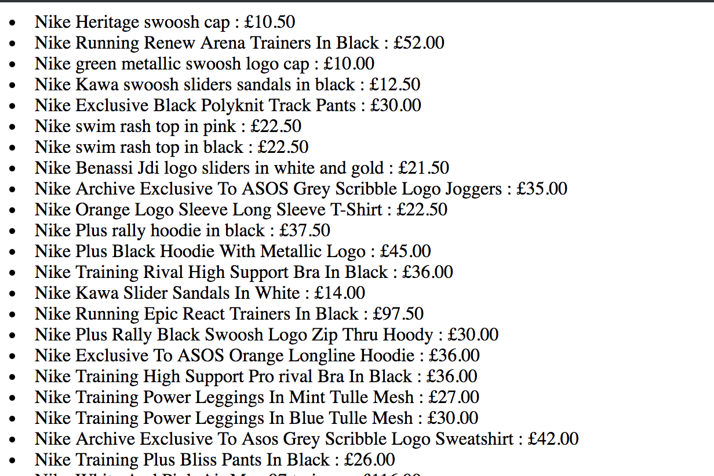

# trainers-app

A simple Sinatra App that scrapes trainer prices from Asos using a rake task and then renders it in a view.

## How to use
* `git clone` this repo
* `brew install prostgres` if you need Postgres installing
* `bundle install
* `rake scrape_asos` to scrape prices
* `rackup` to run the sever
* `http://localhost:9292/` to view the data in the browser
